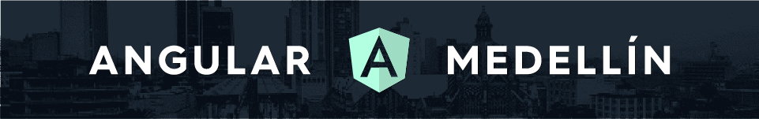

  

  
  
  
  
  
  
    
  
  
  

# ⭐️ Angular Medellín ⭐️

Angular Medellín es una comunidad de personas interesadas en aprender un poco más de **[Angular](https://angular.io/)**:

- :muscle: Compartimos las mejores prácticas a la hora de desarrollar Single-Page Applications
- :raised_hands: Discutimos las últimas tendencias, sus pros y sus contras
- :microphone: Tenemos speakers compartiendo sus éxitos y fracasos escribiendo aplicaciones en Angular

Si estás en Medellín y eres apasionado como nosotros, ¡ven a nuestro próximo meetup y haz parte de nuestra comunidad!

## 📆 Meetups 📆

1. **[Hablemos de Angular en Medellín](meetups/1-hablemos-de-angular-en-medellin)**
2. **[Cosas que no sabías de Angular](meetups/2-cosas-que-no-sabías-de-angular)**

## 📢 Chat 📢

Todos saben que las comunidades más cool 😎 tienen un chat privado. ¡Nosotros también! Si quieres conocer las últimas noticias y estar al tanto de todas las novedades, **¡Únete [aquí](https://gitter.im/angular-medellin/Lobby?utm_source=share-link&utm_medium=link&utm_campaign=share-link)!**

## 📁 Recursos 📁

Hemos creado una lista con los eventos más importantes de Angular en el mundo. Si nos falta alguno, no temas en añadirlo al documento.
**¡Échale un vistazo [aquí](RESOURCES.md)!**

# 💪 ¡Participa! 💪

## 👦 ¿Quieres ser speaker? 👧

¡Nos encantaría que subieras al escenario!, no hace falta ser un experto :neckbeard: ni ahondar en aspectos técnicos, de hecho, nos encantan las charlas creativas.

Para proponer una charla sólo ingresa un issue [aquí](https://github.com/angular-medellin/meetup/issues) :octocat: con el tema de la charla y una pequeña descripción. Luego nos pondremos en contacto contigo.

## 👂 ¿Quieres darnos tu opinión? 👂

Tu opinión es muy valiosa para nosotros, siempre estamos dispuestos a escuchar lo que tengas para decir, bien sea :poop: o :heart:.
Así que no lo pienses dos veces:

- :see_no_evil: Cuéntamos qué tal te ha parecido la comunidad
- :hear_no_evil: Cómo podemos mejorar
- :speak_no_evil: Qué charla te gustaría escuchar la próxima vez

Sólo ingresa un issue [aquí](https://github.com/angular-medellin/meetup/issues) :octocat:.

## 💰 ¿Quieres patrocinarnos? 💰

Angular Medellín es una comunidad sin ánimo de lucro. Usamos el patrocinio para cubrir los costos de los meetups e incentivar a los asistentes a participar.

Si quieres patrocinarnos puedes contactarnos [aquí](https://github.com/angular-medellin/meetup#phone-contacto-phone).

## 🕴 ¿Quieres ser organizador? 🕴

Nos parece maravilloso que quieras participar más activamente en la comunidad. Explícanos por qué y cómo tus habilidades pueden hacer crecer esta comunidad [aquí](https://github.com/angular-medellin/meetup/issues) :octocat:.

# ❤️️ Agradecimientos ❤️️

## 👫 Contribuyentes 👫

Gracias a estas maravillosas personas ([emoji key](https://github.com/kentcdodds/all-contributors#emoji-key)):

<!-- ALL-CONTRIBUTORS-LIST:START - Do not remove or modify this section -->
| [ Juan Herrera](http://juandavidherrera.com/en) [💬](#question-jdjuan "Answering Questions") [📋](#eventOrganizing-jdjuan "Event Organizing") [🔍](#fundingFinding-jdjuan "Funding Finding") [👀](#review-jdjuan "Reviewed Pull Requests") [📢](#talk-jdjuan "Talks") [📖](https://github.com/angular-medellin/meetup/commits?author=jdjuan "Documentation") | [ Alejandro Ñáñez Ortiz](http://co.linkedin.com/in/alejandronanez/) [📖](https://github.com/angular-medellin/meetup/commits?author=alejandronanez "Documentation") [💻](https://github.com/angular-medellin/meetup/commits?author=alejandronanez "Code") [💬](#question-alejandronanez "Answering Questions") [👀](#review-alejandronanez "Reviewed Pull Requests") [📋](#eventOrganizing-alejandronanez "Event Organizing") | [ Daniel Correa](https://github.com/danielcb29) [📖](https://github.com/angular-medellin/meetup/commits?author=danielcb29 "Documentation") [📋](#eventOrganizing-danielcb29 "Event Organizing") | [ Melina Mejía Bedoya](https://github.com/MelinaMejia95) [📖](https://github.com/angular-medellin/meetup/commits?author=MelinaMejia95 "Documentation") | [ Felipe Jaramillo ](https://github.com/p1p3) [📢](#talk-p1p3 "Talks") | [ Diego Coy](https://diegocoy.com) [📢](#talk-UnJavaScripter "Talks") | [ Laura Ciro](https://github.com/ltciro) [📋](#eventOrganizing-ltciro "Event Organizing") |
| :---: | :---: | :---: | :---: | :---: | :---: | :---: |
| [ Fabian Buitrago](https://github.com/Fabian-Buitrago) [📋](#eventOrganizing-Fabian-Buitrago "Event Organizing") |
<!-- ALL-CONTRIBUTORS-LIST:END -->

Este proyecto sigue la especificación de [all-contributors](https://github.com/kentcdodds/all-contributors). Cualquier tipo de contribución es bienvenida!

## 🤝 Patrocinadores 🤝

