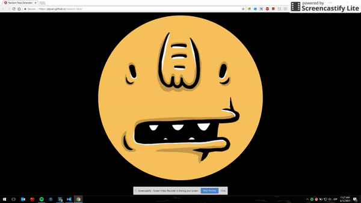

# Random Face

Create an Angular Application that shows a different [adorable face](http://avatars.adorable.io) every 2 seconds.

## Demo

See demo **[here](https://jdjuan.github.io/random-face/)**

# Solution

Post your solution in the [Issues](https://github.com/angular-medellin/meetup/issues/new) section with the link to your GitHub repository.