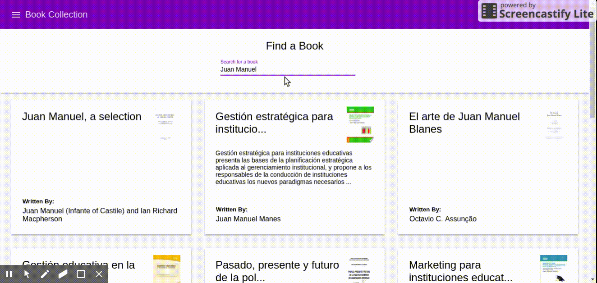

# Book Collection :bowtie:

Create an Angular Application that search books from google api and add/remove to a collection.

## Demo 💻

# Solution 📋

Post your solution in the [Issues](https://github.com/angular-medellin/challenges/issues) section with the link to your GitHub repository and **receive a gift next meetup!** ⭐️⭐️⭐️
