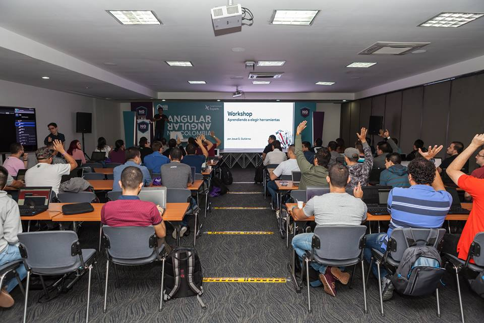

  

# 3. Labs 🔨

---

# UPDATE: ⛔️ ¡Ya escogimos los ganadores! ⛔️
🌟 ¡Síguenos en nuestras redes para enterarte del próximo! 🌟

---

## Descripción

Los Angular Labs son un espacio en el que pasas un día completo creando una aplicación de Angular de principio a fin de la mano de expertos 🤠

En tan solo 8 horas tendrás tu propia aplicación desplegada en la nube y disponible para que todos tus amigos la vean! 😎

Para aplicar basta con que abras un issue [**aquí**](https://github.com/angular-medellin/meetup/issues/new) y nos cuentes:

* 😃 Quién eres
* 😁 Por qué quieres participar de los Angular Labs
* 🤓 Cuánto tiempo llevas codificando en Angular

## Formato

* **Capacidad:** 10 personas
* **Incluye:** Almuerzo y Stickers

## Ganadores

Las personas seleccionadas serán anunciadas una semana antes a través del [Slack](https://join.slack.com/t/ng-colombia/shared_invite/enQtMjgwMjc3ODk1NjMyLTBjMmE4YmQzYTA0ZGNjNTVhMmNlMmQ1YWRjNGFlOWE4MDBjMWM3M2UwNmFjZWFhNmZkYzVmNDc3ZWQ5MmQwZmY) de la comunidad. Serán contactadas para solicitar información adicional. 

> En caso de no responder perderán la oportunidad 👀

## Criterios de Selección

En caso de haber más de 10 personas interesadas utilizaremos los siguientes criterios de selección:

- **Diversidad:** Vienen de grupos poco representados en la industria de software
- **Contribución:** Nivel de contribución a la comunidad
- **Respuesta:** Entusiasmo e interés mostrado en su aplicación

    

<!---
Metodology:

NOT GOOD IDEA:
- Colaborative work is not ideal because they have to learn how to work together, how to integrate together, etc.
- Allowing them to chose what to work on because they will probably bring very complex ideas, and they won't be able to finish

Methodology:
- Have them build the applications individually with the help of tutors
- Give them a specific set of challenges by capacity (easy, medium, hard)
- Teach them first how to deploy an app. To have them constantly deploy it.
  
Agenda: All of the following activities are timeboxed:

- Welcome introduction
- Explain the methodology
- Give good tips
- Teach how to deploy
- Give them the challenges to choose 
- Explain planning methodology
- Have them plan
- Have them write first interation of code
- Have them plan second round
- Have them finish
- Presentation

Challenges:
- [Easy] Directory System: Where you show the pictures of all employees and when you click you see their info
- []https://genderize.io/
- https://github.com/Hipo/university-domains-list
- https://pdflayer.com/
- http://numbersapi.com/32
- https://robohash.org/
- https://yesno.wtf/api

Tutors:
- Those most proficient in the first Angular Lab are asked to join the next one
- Carlos, Laura, Daniel, etc.

-->
