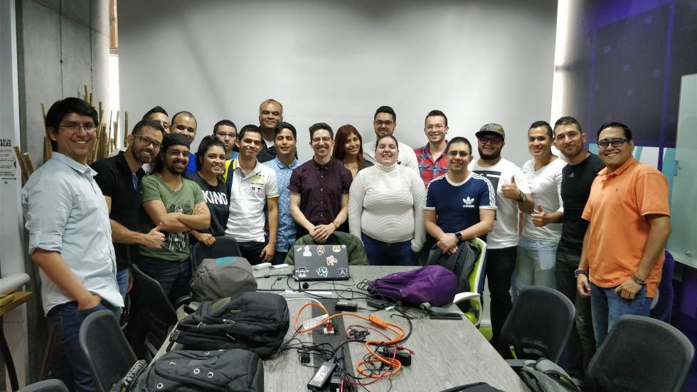

  

# Angular Labs 🚀

  <strong>
  <a href="https://docs.google.com/forms/d/e/1FAIpQLScuysGKtyW51-EJPgrZYOMYm_qm_PuS77g05Rad1D-PZQQ7vw/viewform">
    APLICA AHORA
    </a>
    </strong>

## 1. Descripción 📋

Los Angular Labs son un espacio en el que pasas un día completo creando una aplicación de Angular de principio a fin de la mano de expertos 🤠

En tan solo 8 horas tendrás tu propia aplicación desplegada en la nube y disponible para que todos tus amigos la vean! 😎

Para aplicar basta con que llenes **[este formulario](https://docs.google.com/forms/d/e/1FAIpQLScuysGKtyW51-EJPgrZYOMYm_qm_PuS77g05Rad1D-PZQQ7vw/viewform)**

* 😃 Las personas seleccionadas serás anunciadas el próximo **Lunes 9 de Abril**
* 👶 No importa cuánta experiencia tengas, tenemos un desafío para ti
* 🍕 El refrigerio está incluído

## 2. Condiciones ☑️

1. **[Configurar tu Ambiente](https://gist.github.com/jdjuan/8746c2950c12e51c09251ee2a5070119#-preparaci%C3%B3n-angular-lab-)**
1. **[Ingresar al Slack](https://join.slack.com/t/ng-colombia/shared_invite/enQtMjgwMjc3ODk1NjMyLTBjMmE4YmQzYTA0ZGNjNTVhMmNlMmQ1YWRjNGFlOWE4MDBjMWM3M2UwNmFjZWFhNmZkYzVmNDc3ZWQ5MmQwZmY)**

## 3. Ganadores 🏆

Las personas seleccionadas serán anunciadas una semana antes a través del [Slack](https://join.slack.com/t/ng-colombia/shared_invite/enQtMjgwMjc3ODk1NjMyLTBjMmE4YmQzYTA0ZGNjNTVhMmNlMmQ1YWRjNGFlOWE4MDBjMWM3M2UwNmFjZWFhNmZkYzVmNDc3ZWQ5MmQwZmY) de la comunidad. Allí se les dará toda la información.

> En caso de no confirmar se le dará la oportunidad a alguien más 👀

## 4. Criterios de Selección 🤔

En caso de haber más de 10 personas interesadas utilizaremos los siguientes criterios de selección:

- **Diversidad:** Vienen de grupos poco representados en la industria de software
- **Contribución:** Nivel de contribución a la comunidad
- **Respuesta:** Entusiasmo e interés mostrado en su aplicación

    

